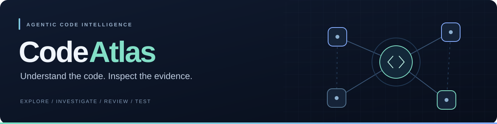

<p align="center">
  
</p>

<p align="center">
  <strong>Explore a repository. Investigate with Claude. Review and test an isolated patch.</strong>
</p>

<p align="center">
  <a href="https://github.com/Kumaryan12/CodeAtlas/actions/workflows/ci.yml"></a>
  
  
  
</p>

<p align="center">
  <a href="#quick-start">Quick start</a> ·
  <a href="docs/demo.md">Demo walkthrough</a> ·
  <a href="#measured-results">Measured results</a> ·
  <a href="docs/resume-readiness-evidence.md">Engineering evidence</a> ·
  <a href="docs/reference.md">Technical reference</a>
</p>

---

## Your codebase, with context

CodeAtlas turns a public GitHub repository into a **commit-pinned workspace** for understanding code and preparing changes. Browse source and symbols, explore file relationships, ask questions with citations, and give a bounded AI agent an investigation or editing task.

Static analysis establishes code structure. Local embeddings retrieve relevant excerpts. Claude chooses tools and explains findings. Proposed edits stay in a separate draft, with reviewed diffs and explicitly authorized Docker tests.

**A personal project in applied AI and Python engineering.** Working capabilities, repeatable evaluations, and known failures are documented together.

## What you can do

| | Capability | In the workspace |
|---|---|---|
| **01** | **Explore source** | Import Python, JavaScript, and TypeScript files; browse functions, classes, imports, and exact source locations. |
| **02** | **Understand connections** | Switch between **Dependencies** and supported Python **Data Flow**. Inspect edge evidence, cycles, and unresolved imports. |
| **03** | **Ask with evidence** | Preview retrieved excerpts, ask Claude a focused question, and follow citations back to source. |
| **04** | **Investigate with an agent** | Follow model-selected reads, MCP tool calls, observations, budgets, and errors in the run trace. |
| **05** | **Review a proposed change** | Inspect an isolated draft and download its diff. The original snapshot stays unchanged. |
| **06** | **Test within boundaries** | Authorize a fixed test profile and inspect versioned results from a restricted Docker container. |

**Import → Explore → Ask → Investigate → Review → Test**

Architecture views hide unconnected files by default. Use **Show unconnected files** to include them. An import arrow means “depends on”; a data-flow arrow means supported potential value passing. [Understand the distinction →](docs/architecture-views.md)

## How it works

| Layer | Implementation | Responsibility |
|---|---|---|
| **Workspace** | Next.js · React · TypeScript · React Flow | Source explorer, architecture views, Q&A, agent traces, and draft review |
| **Application** | Python · FastAPI · Pydantic | Validated APIs, repository scoping, permissions, and orchestration |
| **Analysis** | Python AST · Tree-sitter | Symbols, imports, dependency resolution, and bounded Python value-flow analysis |
| **Retrieval** | Local MiniLM · BM25 · rank fusion | Symbol-aware chunks, semantic/lexical ranking, and optional dependency expansion |
| **Reasoning** | Claude · structured decisions · MCP | Evidence-based answers and bounded tool-use workflows |
| **Storage** | PostgreSQL · SQLAlchemy · Alembic | Immutable snapshots, embeddings, run state, drafts, and test records |
| **Execution** | Docker · fixed test profiles | Isolated test execution with network, resource, time, and output limits |
| **Verification** | Pytest · Node tests · GitHub Actions | Application tests, sandbox checks, migrations, builds, and evaluation artifacts |

**The agent loop:** task → validated model decision → permitted tool → observation → next decision or finish.

MCP supplies scoped repository-reading tools. The application enforces permissions and budgets. Neither dependency analysis nor the Data Flow view needs an LLM call. [Architecture and design details →](docs/development.md) · [MCP boundary →](docs/mcp-architecture.md)

## Measured results

These are recorded project evaluations, with their scope and limitations—not production guarantees.

| Evidence | Recorded result | Scope |
|---|---:|---|
| Backend verification | **242 passed · 0 skipped** | Includes real local embeddings and Docker tests |
| Frontend verification | **23 passed** | Frontend helpers, graph behavior, proxy rules, and run states |
| Hosted CI | **3 / 3 jobs passed** | Verified [code-fix run](https://github.com/Kumaryan12/CodeAtlas/actions/runs/34714931552); the badge above shows current status |
| Scripted MCP agent evaluation | **6 / 6 passed** | Runtime task and guardrail cases, not live-model accuracy |
| Live repair follow-up | **3 / 3 workflow passes** | Three attempts on one synthetic bug; original tests passed independently |

### Retrieval comparison

Same **40-chunk, eight-file synthetic corpus**. Metrics below average over **18 positively labelled questions** within a 24-case evaluation set.

| Strategy | Recall@6 | MRR@6 | nDCG@6 | Complete evidence |
|---|---:|---:|---:|---:|
| Lexical | 96.8% | 0.944 | 0.924 | 16 / 18 |
| Semantic | 95.4% | 0.944 | 0.920 | 15 / 18 |
| **Hybrid** | **98.1%** | **1.000** | **0.975** | **17 / 18** |
| Hybrid + graph | 95.4% | 1.000 | 0.958 | 15 / 18 |

**What we learned:** combining semantic and lexical signals improved coverage on this corpus; adding graph neighbors sometimes displaced useful evidence. Retrieval recall is **not answer accuracy**.

The repair follow-up resolved a reproduced empty-citation validation failure. However, **two of its three runs still had citation-support flags** despite correct patches and accepted final schemas. Earlier RAG timeout/schema failures are retained in the reports. The datasets are small and authored, not independently held out.

[Full audit →](docs/project-audit.md) · [RAG results →](docs/rag-results-review.md) · [Repair follow-up →](docs/resume-readiness-evidence.md) · [Machine-readable metrics →](docs/evaluation-repair-readiness/summary.json)

## Quick start

**Prerequisites:** Node.js 22.13+, npm, Python 3.14 for the tested dependency set, and Docker Desktop or Docker Engine with Compose. Run locally with one API worker.

### 1. Install

```sh
git clone https://github.com/Kumaryan12/CodeAtlas.git
cd CodeAtlas

# First setup only; preserve an existing .env.
cp -n .env.example .env
npm ci
python3.14 -m venv apps/api/.venv
apps/api/.venv/bin/python -m pip install -r apps/api/requirements-dev.lock
apps/api/.venv/bin/python -m pip install --no-deps -e apps/api
```

### 2. Start the database

With Docker running:

```sh
docker compose up -d --wait postgres
apps/api/.venv/bin/alembic -c apps/api/alembic.ini upgrade head
```

### 3. Start the application

**Terminal 1 — API**

```sh
apps/api/.venv/bin/uvicorn codeatlas.main:app --app-dir apps/api --reload --host 127.0.0.1 --port 8000
```

**Terminal 2 — web**

```sh
npm run dev
```

Open **[CodeAtlas](http://127.0.0.1:3000)**. Interactive API documentation is at **[localhost:8000/docs](http://127.0.0.1:8000/docs)**.

Importing and exploring code works without an AI key. Try `https://github.com/Kumaryan12/CodeAtlas`, then select a snapshot and open **Code** or **Architecture**. Each import creates a separate snapshot of the repository's default branch.

### 4. Enable Claude and local retrieval

Install the optional model dependencies and prepare the pinned weights:

```sh
apps/api/.venv/bin/python -m pip install -e 'apps/api[local]'
apps/api/.venv/bin/python -m codeatlas.ai.local_embeddings --prepare
```

Set these values in the root `.env`, then restart the API:

```dotenv
CODEATLAS_REASONING_PROVIDER=anthropic
CODEATLAS_ANTHROPIC_API_KEY=your_key_here
CODEATLAS_EMBEDDING_PROVIDER=local
CODEATLAS_READ_TOOL_TRANSPORT=mcp
```

Open **Ask → Build semantic index**, preview context, and ask a specific implementation question. Local embeddings need no OpenAI key; Claude still receives retrieved excerpts or tool context when generating answers and decisions. Provider calls may incur charges. Keep keys server-side and never commit `.env`.

<details>
<summary><strong>Optional: enable sandboxed tests</strong></summary>

Build the trusted images:

```sh
docker build -f sandbox/python.Dockerfile -t codeatlas-sandbox-python:v1 sandbox
docker build -f sandbox/node.Dockerfile -t codeatlas-sandbox-node:v1 sandbox
```

Set `CODEATLAS_SANDBOX_ENABLED=true` in `.env` and restart the API. In **Agent**, select editing mode and explicitly authorize a test profile, or review a stopped draft and run its tests manually.

Profiles use Python's `unittest` or Node's built-in test runner. Containers have no network or dependency installation; tests requiring third-party dependencies may not run. Results apply to the tested draft version only.

[Execution setup, profiles, and limits →](docs/reference.md#sandboxed-tests)

</details>

<details>
<summary><strong>Configuration and troubleshooting</strong></summary>

- Preserve your existing `.env` when updating. Configuration changes require restarting the relevant services.
- If the database port or credentials change, update `CODEATLAS_DATABASE_URL` as well. Changing Compose variables does not change credentials in an existing volume.
- `/api/health` checks API liveness; `/api/ready` checks database connectivity. `alembic check` separately checks schema agreement.
- Changing embedding configuration requires rebuilding affected indexes. Switching the reasoning provider does not rebuild embeddings.
- A `partial` snapshot retains successfully parsed files; inspect parser warnings and skipped-file details.
- Run one API worker and keep the app on loopback. Authentication and public deployment hardening are not included.

[Complete configuration and API reference →](docs/reference.md)

</details>

## Test and reproduce

```sh
apps/api/.venv/bin/pytest apps/api/tests -q
apps/api/.venv/bin/ruff check apps/api
apps/api/.venv/bin/ruff format --check apps/api
npm run lint
npm run typecheck
npm test
npm run build
```

The default backend suite skips optional live-model and Docker checks. After preparing the local model and trusted images, reproduce the full suite with:

```sh
CODEATLAS_TEST_DOCKER=1 CODEATLAS_TEST_LOCAL_EMBEDDINGS=1 \
  apps/api/.venv/bin/pytest apps/api/tests -q
```

Reproduce retrieval comparisons **without answer-model calls**:

```sh
apps/api/.venv/bin/python -m codeatlas.evaluation.rag --output /tmp/rag-local.json
```

[Evaluation commands and methodology →](docs/rag-evaluation.md) · [Live repair demo →](docs/demo.md)

## Boundaries worth knowing

- **Source is untrusted.** Importing and analyzing a repository does not execute its code. Execution requires an authorized sandbox profile.
- **Drafts are proposals.** CodeAtlas does not automatically apply, push, deploy, or open pull requests.
- **Evidence needs review.** Valid citation IDs do not guarantee that every claim follows from its source.
- **Static analysis is partial.** Data Flow supports selected Python patterns, not complete runtime lineage or JS/TS flow.
- **This is a local MVP.** Public GitHub snapshots only; no authentication, durable job queue, or production multi-user guarantees. Visual browser verification remains outstanding.

## Explore the engineering

| Start with… | For… |
|---|---|
| [Demo walkthrough](docs/demo.md) | A five-minute tour with clearly labelled recorded evidence |
| [Architecture views](docs/architecture-views.md) | Import direction, value-flow evidence, and coverage limits |
| [MCP architecture](docs/mcp-architecture.md) | Client/server responsibilities and tool boundaries |
| [RAG evaluation](docs/rag-evaluation.md) | Local embeddings, ranking metrics, and reproducibility |
| [Readiness evidence](docs/resume-readiness-evidence.md) | The final-response fix, repeated runs, and remaining citation issues |
| [Project audit](docs/project-audit.md) | Capabilities, measured improvements, and open gaps |
| [Technical reference](docs/reference.md) | Detailed setup, endpoints, budgets, and sandbox behavior |
| [Repository structure](docs/structure.md) | Where the implementation lives |
| [Interview package](docs/resume-ready.md) | Defensible project claims and design tradeoffs |

---

<p align="center"><strong>Ground the explanation. Bound the action. Keep the evidence.</strong></p>
